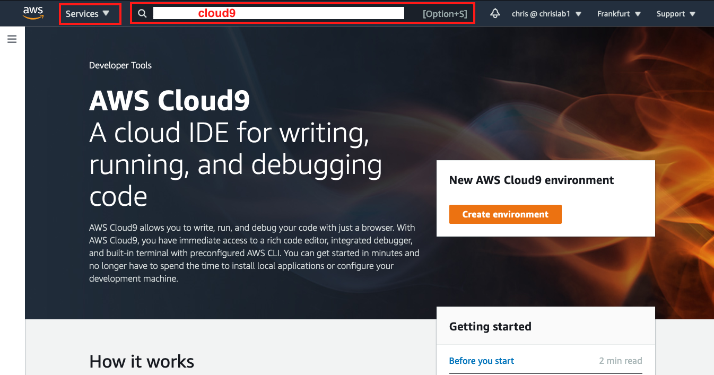
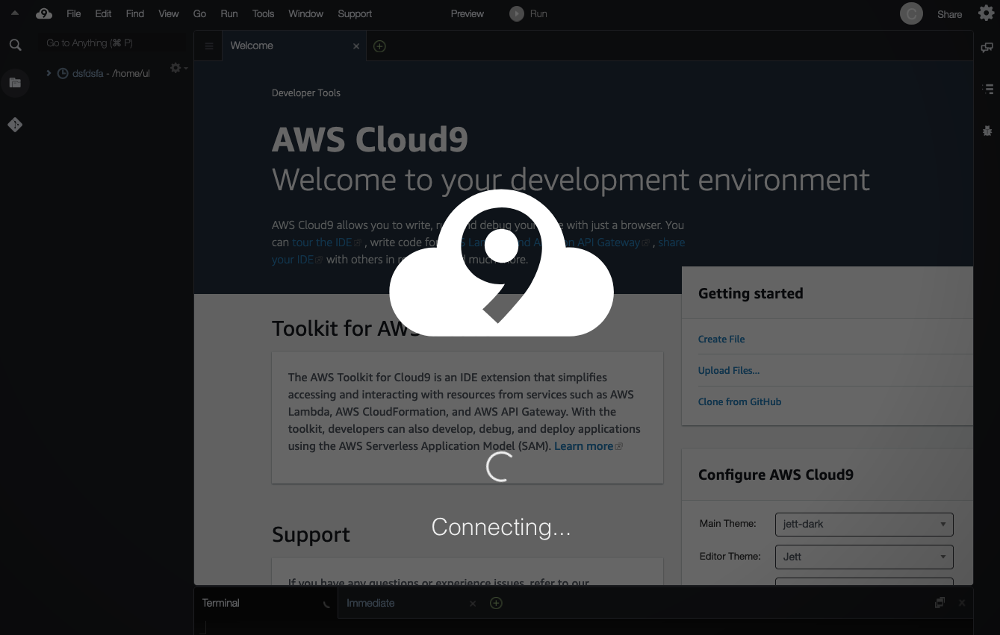
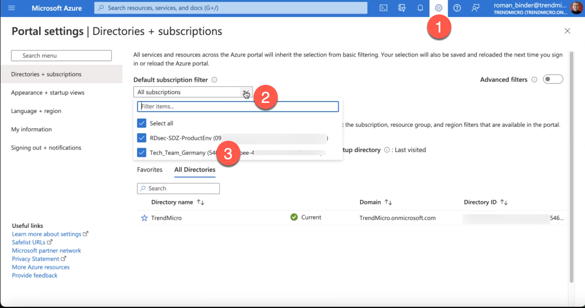

# Cloud One DevOps on Azure

This repo contains a shell script that:

- creates an Azure Kubernetes Services cluster (AKS)
- creates an Azure Container Registry (ACR)
- creates Azure Pipelines
- pulls images and builds 3 different containers
- deploys Trend Micro SmartCheck and integrates it in the pipelines
- deploys Trend Micro Cloud One Container Security and integrates it in the pipelins
- creates "groups" in Trend Micro Cloud One Application Security and deploys an agent in the apps
  Under `addons` there is a script called `up.scanImageAz.sh` that will send 10 images to SmartCheck and have them scanned

# Prerequisites -----DO READ-----

## Shared Azure Accounts:

If you share an Azure account with a co-worker, make sure that you both use different project names and that one project name is not a subset of the other one: eg cloudone and cloudone01 would be bad, but cloudone01 and cloudone02 would be fine (I know... there is room for improvement here)
<br/>
Using shared accounts in the same region has not (yest) been tested.    If you use shared Azure Accounts, please use different regions for now

## Required Licenses and Accounts:

You need the following licenses or accounts:

* **CloudOne Account**
  You can register for a trial here: [https://cloudone.trendmicro.com/register](https://cloudone.trendmicro.com/register)
* **Dockerhub account**
  This is required to deal with docker image-pull-rate-limits. The buildscipts of the Apps will do authenticated pulls (to https://hub.docker.com) from the pipeline.
  For more info on the Dockerhub pull rate limits, see: https://www.docker.com/increase-rate-limits
* **Azure account**
* **AWS account**  This bash script has been tested on Ubuntu 18.06 in AWS Cloud9.  Attempts to use **Azure Cloudshell** were unsuccessful as the Azure Cloudshell seems to abort connections after 15 minutes of inactivity (according to the documentation in 2020).  However during tests, this disconnection also happend at shorter intervals and it was totally unpredictable.  This script relies heavily on enviroment variables.  Any disconection from the shell clears all environment variables.  For this reason we have choosen to use AWS Cloud9 as the "desktop" for running this script.  Any Ubuntu 18.06 desktop should work as well, but it has not been tested.

## Setup an AWS cloud9 environment

AWS Cloud9 will **only be used to get a bash desktop where we can run the script from**.Nothing else will be created in AWS.

- login to the AWS console
- select the region you want to work in (from the dropdown at the right top of the screen; again: this is only for the bash desktop)
- go to Cloud9 (either use the drop-down labelled "services" and select Cloud9, or in the search bar enter "Cloud9")
  
- Create an Environment
- Give it a name to your liking e.g. c1DevOpsOnAzure and click "Next Step"
- As indicated in the screenshot below, make the following selections
- select `Create a new EC2 instance for environment (direct access)`
- use `t3.small`
- use `Ubuntu Server 18.04 LTS`  (**important!**)
  
- For all of the other settings, accept the default
- **Add new tag**  Optionally, tag your Cloud9 environment to your liking (tags are good)
- "Next Step" and "Create Environment"
- The creation of the new environment may take 2-3 minutes.
  

## Create an Azure DevOps Organization

You may use an existing Azure DevOps Organization for this script, but it may be cleaner to create a separate oneTo create an Azure DevOps Organization, follow the steps in the screenshot below:

- login to https://dev.azure.com  (e.g. "start free" and login with your trend micro email address)
- click on "New organization"   and enter a name for the organization that you want to create
  Note that the Azure Organization must be "GLOBALLY UNIQUE"
  

## Create an _Azure_ PAT (Personal Access Token)

You will use this as a configuration variable in the 00_define_vars script later onTo generate an **Azure** PAT, follow the steps in the screenshot below:

1. login to https://dev.azure.com/  and
2. click on the "User Settings" icon (the littlen man) at the right top of the screen
3. In the pull-down menu, scroll down and click "Personal Access Tokens"
4. In the main area of the screen, click on the blue "+" to create a "New Token"
5. Give your token a name
6. Select the **Azure DevOps Organization** that you created above
7. The longest Expiration period is 1 year.
8. This script will create resources of different types.  For convenience, give the token full access.
   

## Find your Azure Subscription for this project

**This is a critical step in the process.  If you are not sure, please consult with your trainer before continuing**
When you use a corporate account in Azure, you may have multiple Azure Subscriptions linked to your Azure account.  The script in this repo will create resources of different types in Azure, so make sure that the Subscription that you select has sufficient rights.  The name of this subscription will have to be entered in the `00_define_vars.sh` file, which you will configure later.  
If you have a `PAY AS YOU GO` subscription, then take that one.
Definity do **NOT** take the subscription that starts with `RDsec-SDZ...`
Here is a screenshot on how to find your subscriptions
Take a note of the the _name_ (not the ID) of that subscription.  You will have to enter it in the `00_define_vars.sh` file, which you will configure later. 


## Create a _GitHub_ PAT (Personal Access Token)

You will use this PAT to clone this GIT repository in the next stepTo generate a **GitHub** PAT, follow the steps in the screenshot below:

1. login to https://github.com
2. click on your account at right top of the page
3. from the drop-down menu, choose “settings” from the drop down box
4. in the left margin, scroll down and select “Developer Settings”
5. click on Personal Access Tokens
6. in the main pane, click on Generate new Token
7. for convenience, select all scopes

Store this PAT in your password manager.
You will also need it to clone this repository


## Clone this repository

From the bash shell in cloud9, run the following command to clone this repository.
When prompted for the github **Password**, enter your github **PAT** (Personal Access Token); NOT YOUR PASSWORD

```shell
git clone https://github.com/cvdabbeele/cloudOneOnAzure.git
cd cloudOneOnAzure
```

## Configure `00_define_vars.sh`

Copy the sample file

```shell
cp 00_define_vars.sh.sample 00_define_vars.sh
```

Edit the `00_define_vars.sh` file with the built in editor of Cloud9 or with your prefered editor (e.g. vi or nano).
You can find the file-browser in the left margin in cloud9.  Just double click the `00_define_vars.sh` file to open it in the editor.
Make sure to enter all the variables up to the section:
`#### --------------------------------------------------------------------------------------`
`#### -----below this line are default settings which may be optionally customised----------`
`#### --------------------------------------------------------------------------------------`

The rest are preconfigured default variables which you can use without changes.
Don't forget to save the file.

## Expand the disk of your Cloud9 desktop

Our Cloud9 environment only has 10Gb of disk space.
Let's resize it to 20GB

```
df -h /  #notice the line /dev/nvme0n1p1 says 9.7G
./resize.sh 40
df -h /  #notice the line /dev/nvme0n1p1 now says 39G 
```

## Disable the AWS-managed temporary credentials

Return to your Cloud9 environment, go to the Cloud9 icon in the top menu bar and click on the AWS Cloud9 tab (depending on your Cloud9 "theme" this may show as the number 9 in a cloud icon).   If you don't see the menu bar as indicated in the screenshot below, hover the mouse over the top of the window. The menu bar should roll down and become visible.
Go to -> Preferences -> scroll down and expand "AWS Settings" (not AWS Configuration)-> Credentials -> uncheck "AWS managed temporary credentials"


## run `. ./up.sh` to deploy the environment

Important: don't forget the first dot
This additional dot "sources" the up.sh script and makes the variables that are created in the script available to the bash shell.
To troubleshoot any issues with the script, you can set the variable **VERBOSE** to 1 in your `00_define_vars.sh` script, and run `. ./up.sh` again.
This will print a LOT of information to the screen

```shell
. ./up.sh
```

If this is the first time that you run this script, it will ask you to authenticate to Azure as indicated below

```
Running az login.  Follow the instructions below to login.  The script will continue after you have logged in via the browser on your workstation
WARNING: To sign in, use a web browser to open the page https://microsoft.com/devicelogin and enter the code CPXY8QQY6 to authenticate.
```

On your computer, open a browser and go to the URL mentioned above, then enter the code mentioned above to login
If you are using your Trend Micro corporate Azure subscription, you will have to authenticate a second time with your email address and then one more time with the multi-factor  authentication tool.
After you have successfully logged in to Azure, the script should continue by itself.
Here are some screenshots for your reference.
The total runtime of the script is about 15-30 minutes.

### Configuring and validating variables


### Deploing AKS cluster


### Adding C1AS


### Deploying SmartCheck


### Adding C1CS


### Adding internal registry to SmartCheck


### Adding Demo Apps


### Adding ACR repository to SmartCheck


### Creating Azure Pipelines


### Next Step: How to Demo

#### Checkout [howToDemo.md](howToDemo.md) for a few typical demo scenarios

### Tear down

```shell
./down.sh
```

To avoid excessive costs when not using the demo environment, tear-down the environment. The ./down.sh script will delete the AKS cluster, the resource group, Roles, Subnets, Service Principals,....
The Cloud9 EC2 instance will stop, but remain available for later.

To start the enviroment again, simply reconnect to your Cloud9 environment and run **./up.sh**
This will redeploy everything in Azure again from scratch without the need of any configuration.
