# How to Demo

- [How to Demo](#how-to-demo)
  - [Prepare for the Demo](#prepare-for-the-demo)
    - [1. Configure the Cloud One Application Security policies for MoneyX](#1-configure-the-cloud-one-application-security-policies-for-moneyx)
    - [2. Checkout the pipelines of MoneyX](#2-checkout-the-pipelines-of-moneyx)
    - [3. Start 2 additional pipeline-runs of MoneyX](#3-start-2-additional-pipeline-runs-of-moneyx)
    - [Ensure to have the following browser tabs opened and authenticated.](#ensure-to-have-the-following-browser-tabs-opened-and-authenticated)
  - [Security Gates for CI/CD pipelines](#security-gates-for-cicd-pipelines)
- [Demo Azure pipeline integrations with SmartCheck](#demo-azure-pipeline-integrations-with-smartcheck)
  - [Show the pods used by C1CS](#show-the-pods-used-by-c1cs)
  - [Show smartcheck integration in the pipeline](#show-smartcheck-integration-in-the-pipeline)
  - ["Risky images are not pushed to the Registry"](#risky-images-are-not-pushed-to-the-registry)
  - [Vulnerable image got deloyed by "./pushWithHighSecurityThresholds"](#vulnerable-image-got-deloyed-by-pushwithhighsecuritythresholds)
  - [Second pipeline walkthrough: Demo runtime protection by CloudOne Application Security (C1AS)](#second-pipeline-walkthrough-demo-runtime-protection-by-cloudone-application-security-c1as)
    - [Attack and Protect the running container](#attack-and-protect-the-running-container)
    - [Walk through the integration with CloudOne Application Security](#walk-through-the-integration-with-cloudone-application-security)
  - [Third pipeline walk through: Demo CloudOne Container Security (Admission Control)](#third-pipeline-walk-through-demo-cloudone-container-security-admission-control)
  - [Deploy a "rogue" container](#deploy-a-rogue-container)
- [Pull and scan additional images](#pull-and-scan-additional-images)

## Prepare for the Demo

In this demo scenario we will be using the MoneyX demo application. `This is the only app that has CloudOne Application Security  enabled`.

### 1. Configure the Cloud One Application Security policies for MoneyX

- login to your CloudOne account
- go to `Application Security`.
- in the left margin, you should find (one or more) group(-s) that were created by the script
- enable all policies, with the exception of the `IP Protection` and set them to REPORT as indicated below.

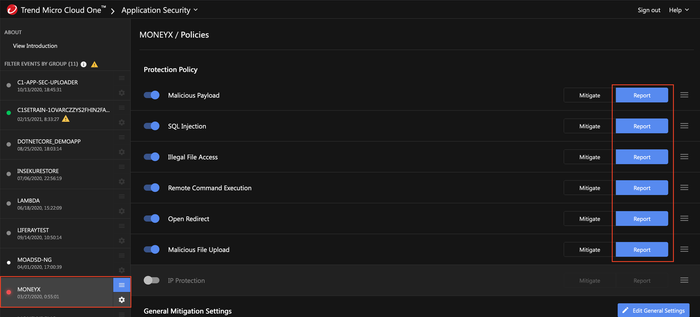

### 2. Checkout the pipelines of MoneyX

In the Azure DevOps console (https://dev.azure.com ) go to Organization -> Project -> Pipelines -> Recently run pipelines -> (click) Moneyx -> Runs
You should see one (or two) pipeline runs, they should both be "failed"
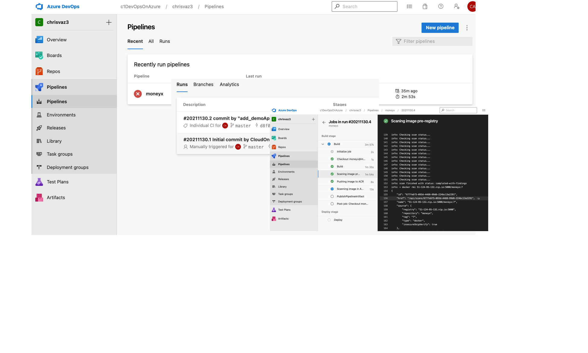

### 3. Start 2 additional pipeline-runs of MoneyX

Before we will demo, we want to have a few MoneyX pipeline-runs available, each with different settings.  We will trigger the following 3 pipeline-runs:

1. **a pipeline-run with low security threshold** (where the number of allow vulenrabilities is set low). This pipeline-run will fail for the moneyX application because SmartCheck will find more vulnerabilities than the threshold setting that we configure for this pipeline-run.  The pipeline will break and this will prevent the image from being pushed to the registry.
   This pipeline-run will be triggered the script **./pushWithLowSecurityThresholds.sh** (see below)
2. **a pipeline-run with high security thresholds**.  This is not what you would want in a production environment.  This pipeline-run  allows a lot of vulnerabilities to be present in the image (up 300 critial ones etc..).  The scan findings will be lower than this threshold and the pipeline will continue, produce a vulnerable image, push it to ACR and then deploy a container of it.  We will use this vulnerable image to demo Cloud One Application Security at runtime.   The use-case here is that in-line scanning in the pipeline is on a *collaborative* basis with Dev and Ops teams.  A rogue team-member may set these threshold-numbers "high" (e.g. 300) in order to get his immage deployed.  Fortunately, C1CS can block the *deployment* (see later).  If the container gets deployed, C1AS can protect the running container.
   This pipeline-run will be triggered the script **./pushWithHighSecurityThresholds.sh** (see below)
3. **a pipeline-run of an image with malware**
   The scipt **pushWithMalware.sh** will modify the Dockerfile so that it will download Eicar and include it in the image at build time.  Then the pipeline will build an infected image out of it.  The script also has the threshold settings set to "high", so the scanner will allow the infected image to be pushed to the registry.  But then when the pipeline tries to deploy the image, C1CS will prevent it (see later)
   <br/>

To do the aboe, run the following 3 scripts:

```shell
./pushWitLowSecurityThresholds.sh
./pushWithHighSecurityThresholds.sh
./pushWithMalware.sh
```

Check if the pipeline-runs start (this may take a minute). See screenshot above, under `Checkout the pipelines of MoneyX`
You can click on a pipeline-run to see its progress in detail (logs) as indicatedin the screenshot above

You should now have 3 pipeline-runs of MoneyX.  The very first time that SmartCheck scans an image may take a lot of time.  We have seen scan times up to 40 minutes.  Subsequent scans typically take 1-2 minutes.

### Ensure to have the following browser tabs opened and authenticated.

- CloudOne Application Security (https://https://cloudone.trendmicro.com/)
- SmartCheck console (to find the URL, in your Cloud9 shell, type: `kubectl get service proxy -n smartcheck` and look for the public IP address)  The port is standard HTTPS (443)
- Azure Devops (https://dev.azure.com )
- Your AWS Cloud9 shell
  <br/><br/>
  <br/><br/>

## Security Gates for CI/CD pipelines

The core of any DevOps environment is the CI/CD pipeline.
In this demo we will show the following security gates
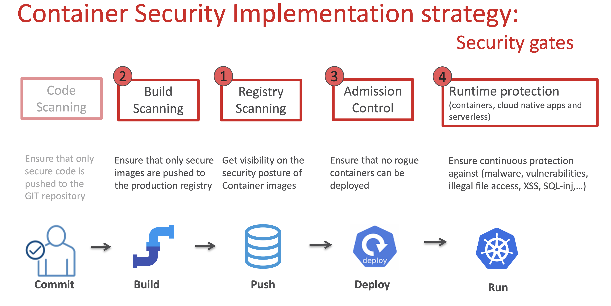
The Code Scanning gate may be added later.  It is/will be, based on our collaboration with Syk

<br/><br/>
<br/><br/>

# Demo Azure pipeline integrations with SmartCheck

- Show the AKS cluster
  In Cloud9 type:

```shell
kubectl get nodes
```

- Show the pods used by smartcheck

```shell
kubectl get pods --namespace smartcheck
```

- Point out when we say that we "scan" an image, we actually have 5 different scanners scanning the image for for specific things

```shell
kubectl get pods --namespace smartcheck | grep -i scan
```

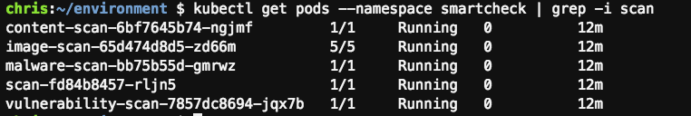

- Also show the deployments

```shell
kubectl get deployments -n smartcheck
```

Deployments ensure that always a given number of instances of each pod is running (in our case this default is 1) but this can be scaled by the usual kubernetes commands.
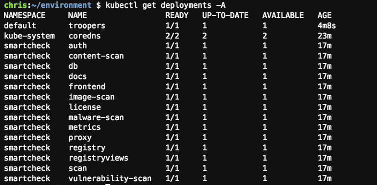

## Show the pods used by C1CS

C1CS deploys different resources in the `trendmicro-system` namespace (by default)
To see all resources, run:

```bash
kubectl get all -n trendmicro-system
```
The deployed resources are:
- pods:
  - `trendmicro-admission-controller`  This pod enforces the settings in C1CS under the Deployment tab in the Policy
  - `trendmicro-scout`  These pods enforce the settings in C1CS under the Runtime tab in the Policy.  These pods insert an eBPF probe in the kernel of the worker-node they are running on.  This eBPF probe allows us to see the function calls that are made by the pods that run on this host. 
- daemonset:
  - the `trendmicro-scout` pod is managed through a daemonset.  A `daemonset` is a special version of a `deployment`.  It ensures that at least one pod is running on each worker-node.  We can verify this.  We have a 2-node cluster and we have 2 scout pods.  
- deployment and replicaset
  - all other pods are managed by "regular" deployments.  If a pod would die, then a new instance would be started.  You can test this by running `kubectl delete pod NAME_OF_THE_POD -n trendmicro-system`  then you can see it being recreated by running `watch kubectl get pods -n trendmicro-system`  (and then press CTRL-C to break the never-ending "watch")  


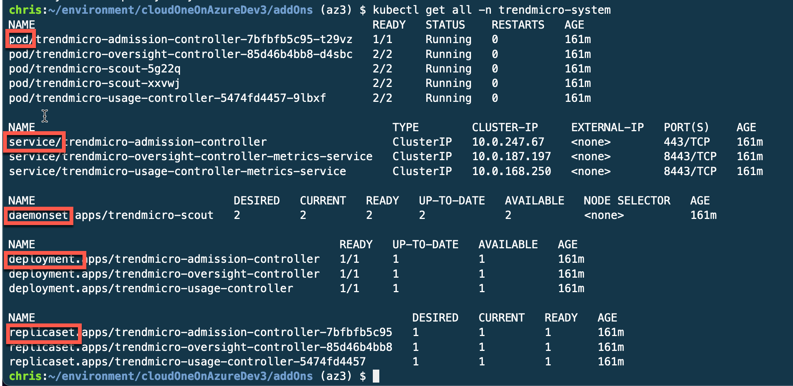

- If (optionally) you want to dive a little deeper you can:

  - also show that we enforce microsegmentation between the pods.
    Show the network policies:

    ```shell
    kubectl get networkpolicies -n smartcheck
    ```

    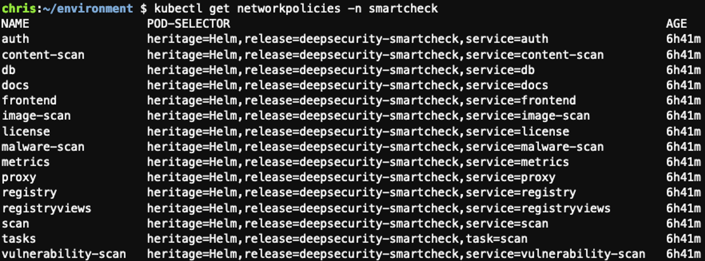

    for example, for the proxy pod we have the following network policy  
    Also good to show is the network policy for the database pod
    Show the ingress and the port 5432

    ```Shell
    kubectl describe networkpolicy db -n smartcheck
    ```

    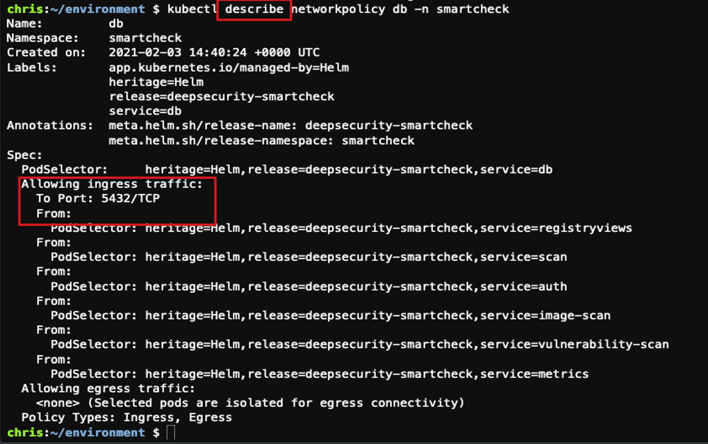
- point out that SmartCheck is deployed using a helm chart with one, single, command.
  To check the version of the deployed SmartCheck, run:

  ```shell
  helm list -n $DSSC_NAMESPACE
  ```

  To deploy smartcheck, one would only run:

  ```shell
  helm install -n $DSSC_NAMESPACE --values overrides.yml deepsecurity-smartcheck https://github.com/deep-security/smartcheck-helm/archive/master.tar.gz
  ```

  To upgrade smartcheck, one would only run:

  ```shell
  helm install -n $DSSC_NAMESPACE --values overrides.yml deepsecurity-smartcheck https://github.com/deep-security/smartcheck-helm/archive/master.tar.gz
  ```
- To find the SmartCheck URL, we need to get the "services".
  Type:

  ```shell
  kubectl get service proxy -n smartcheck 
  ```

  and open a browser to that url
  (e.g. [https://EXTERNAL-IP](https://EXTERNAL-IP))
- Login to SmartCheck with the username/password that you have defined in the 00_define_vars.sh file and show/discuss:

  - the Smart Check dashboard
  - the connected registries and point out how easy it is to add a registry and get full visibility on the security posture of the container-images (you only need the url and credentials with Read-Only rights)
  - the scanfindings
    - show that we scan for malware, vulnerabilities, content and compliance
- Show the Azure GIT Repositories
  
  Show the Dockerfile with eicar
  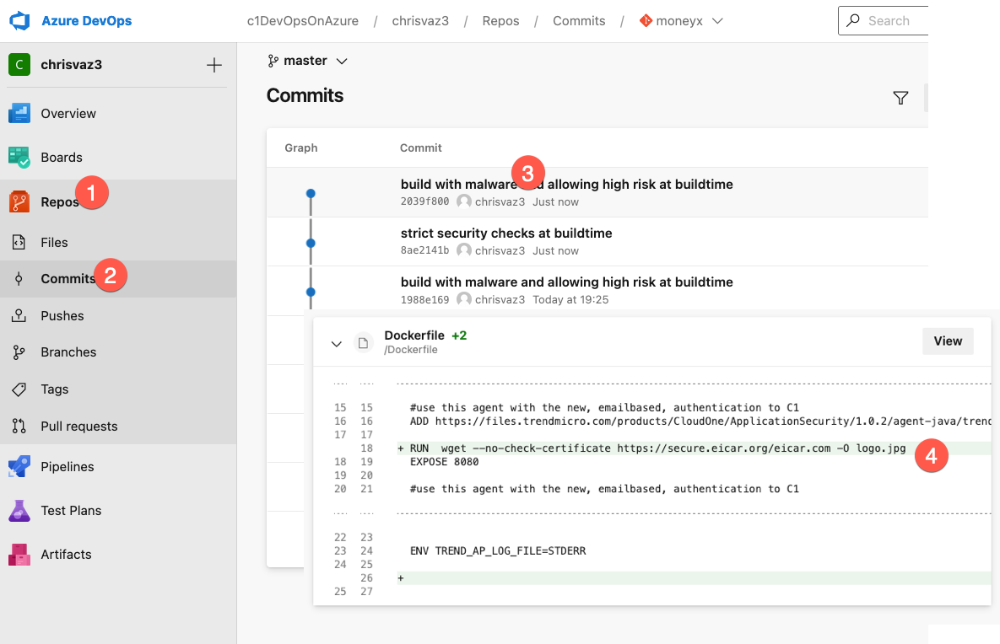

## Show smartcheck integration in the pipeline

Go to the Azure Git Repo and open the **azure-pipelines.yml** file
Show where we integrate smartcheck
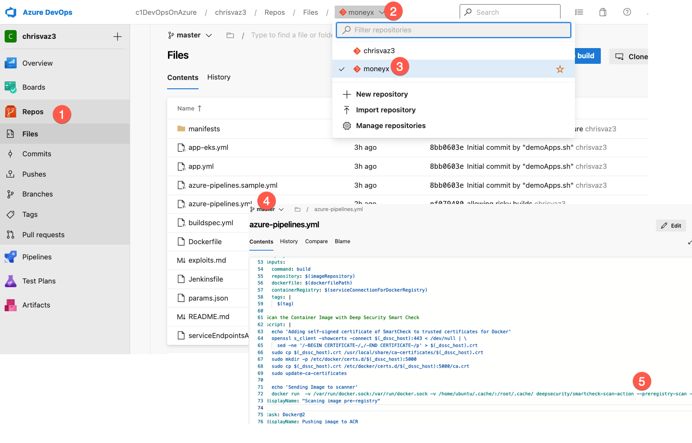
The full command is:

```
        docker run  -v /var/run/docker.sock:/var/run/docker.sock -v /home/ubuntu/.cache/:/root/.cache/ deepsecurity/smartcheck-scan-action --preregistry-scan --preregistry-password=$(_dssc_regpassword) --preregistry-user=$(_dssc_reguser) --image-name=$(containerRegistry)/$(imageRepository):$(_tag) --smartcheck-host=$(_dssc_host) --smartcheck-user=$(_dssc_username) --smartcheck-password=$(_dssc_password) --insecure-skip-tls-verify         --insecure-skip-registry-tls-verify  --findings-threshold='{"malware": 300, "vulnerabilities": { "defcon1": 300, "critical": 300, "high": 300 }, "contents": { "defcon1": 300, "critical": 300, "high": 300 }, "checklists": { "defcon1": 300, "critical": 300, "high": 300 }}'
```

The **smartcheck-scan-action** container is a convenience solution for integrating smartCheck in the pipeline. Alternatively customers can directly call the RESTful API endpoints in SmartCheck

## "Risky images are not pushed to the Registry"

- now dive into a pipeline-run and show the results
  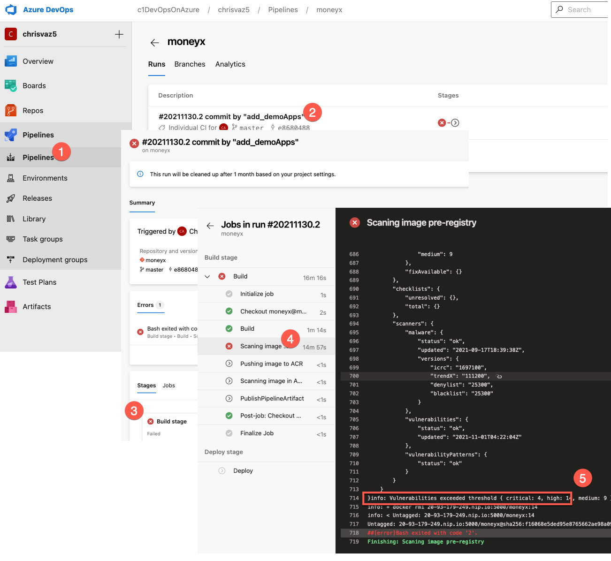

## Vulnerable image got deloyed by "./pushWithHighSecurityThresholds"

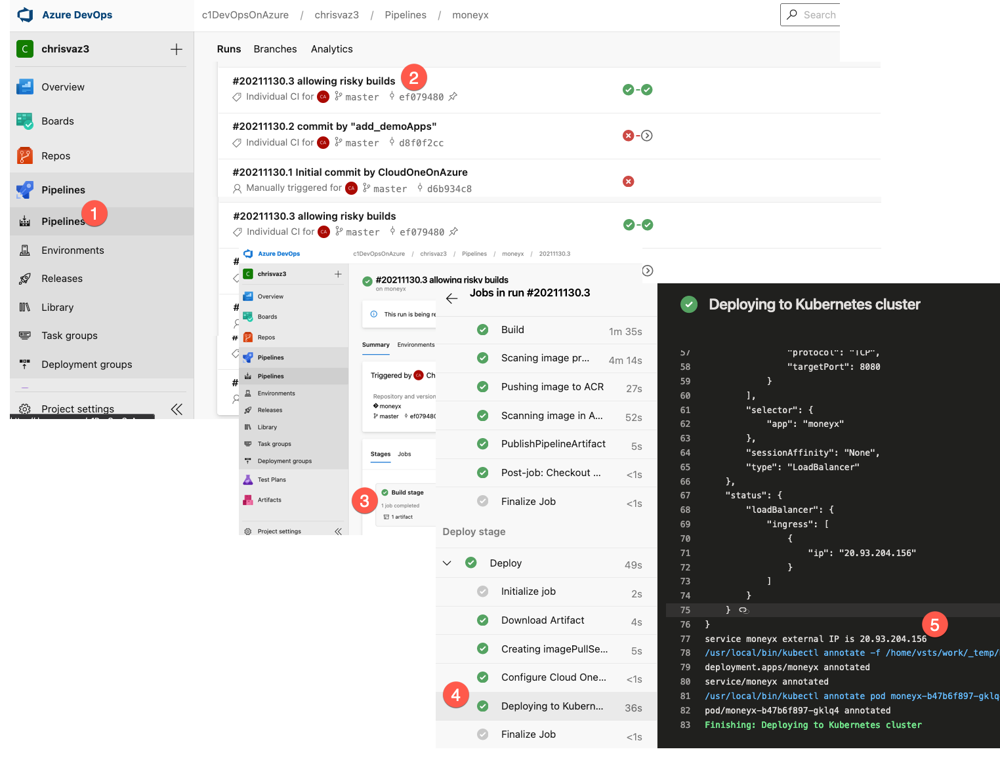

## Second pipeline walkthrough: Demo runtime protection by CloudOne Application Security (C1AS)

Story: We have to deploy with vulnerabilities

- *For an urgent Marketing event, the "business" wants us to put this application online ASAP.
  Our code is fine, but we have found vulnerabilities in the external libraries that we have used and we don't know how to quickly fix them (or the fixes are not yet available).*
  Story:  (or) A rogue developer has set all thresholds to 300 in an attempt to get his image published

Luckilly we have also deployed runtime protection in the app, using CloudOne Application Security

- Walk through the pipeline that says  `allowing risky builds`
  
- Show that this pipeline continued till the end and it has deployed a vulnerable container
- show the deployment in the Cloud9 shell

  ```shell
  cd ~/environment/apps/c1-app-sec-moneyx/
  kubectl get pods 
  kubectl get services 
  ```

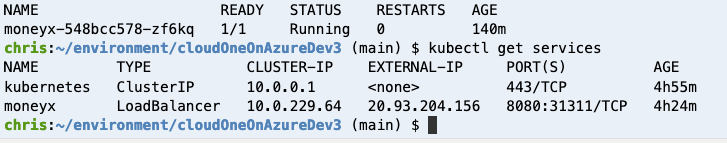

- find the external IP and the port of the moneyx service and open it in a browser on `port 8080`
  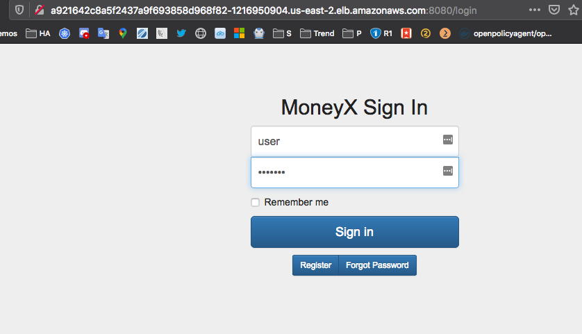
  continue with "Attack and Protect the running container"

### Attack and Protect the running container

Login to the MoneyX app

- username = "user"
- password = "user123"

Go to Received Payments.
You see no received payments.  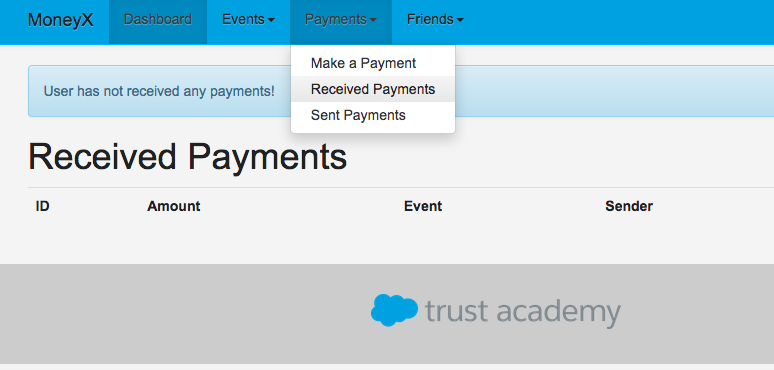

Go to the URL window at the top of the browser and add to the end of the url:  " or 1=1" (without the quotes)
e.g.

```url
http:/20.93.204.156:8080/payment/list-received/3 or 1=1   
.  
```

You should now see ALL payments... which is bad
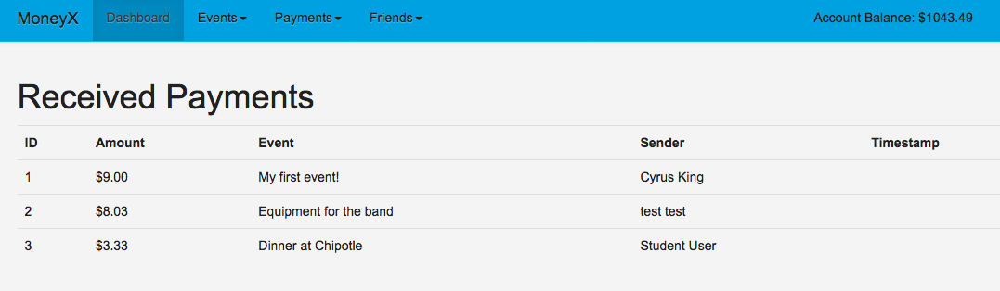

Go to <${C1ASAPIURL}#/events> show that there is a security event for SQL injection
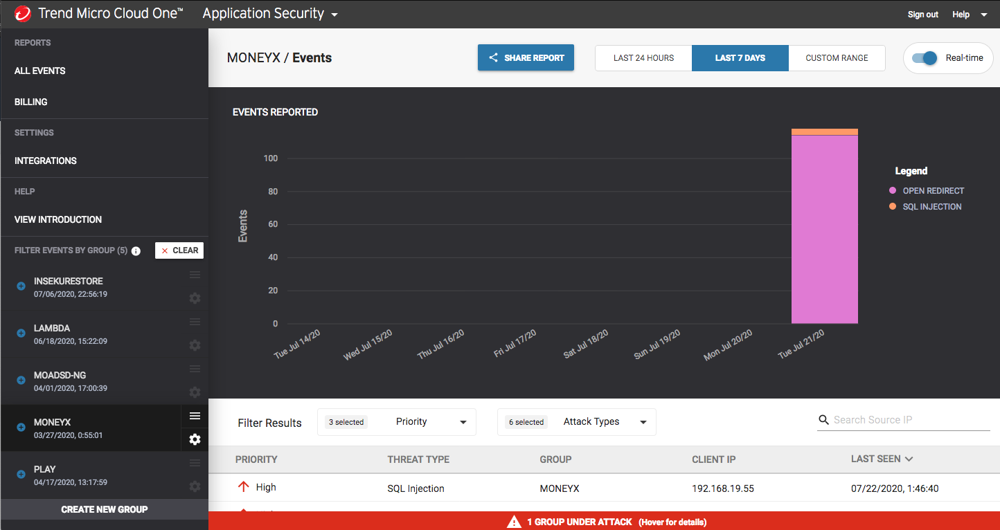
Check security events in CloudOne Application Security

Set the SQL Injection policy to MITIGATE
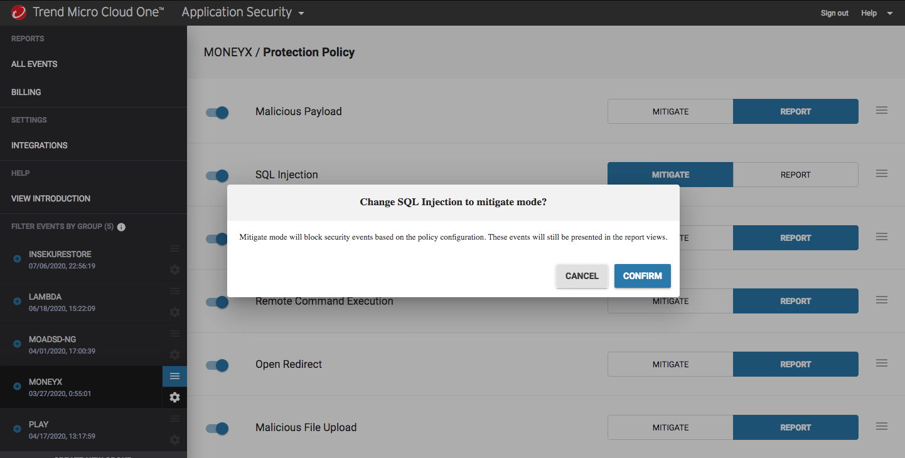
**important:**
Open the SQL Injection Policy and ensure to have all subsections enabled.
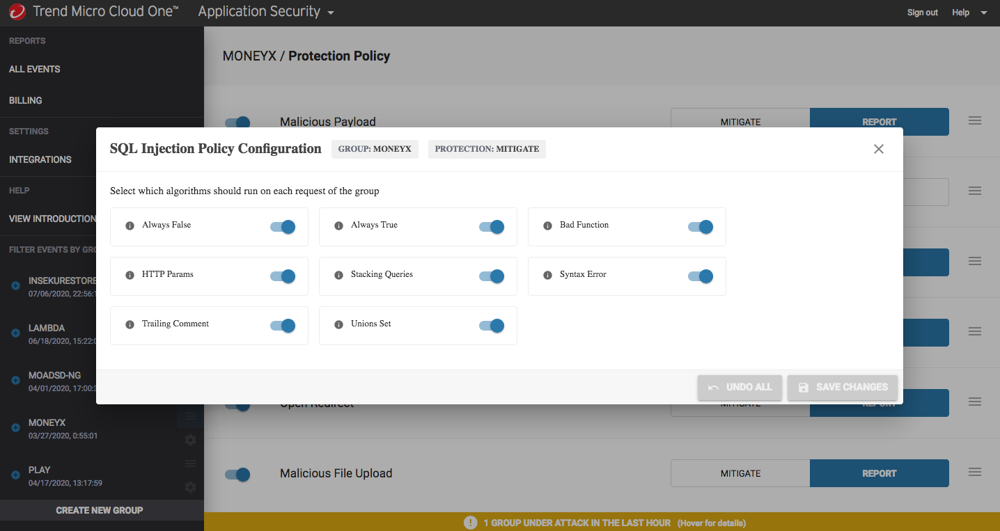

Run the SQL injection again  (just refresh the browser page)   You should get our sophisticated blocking page.
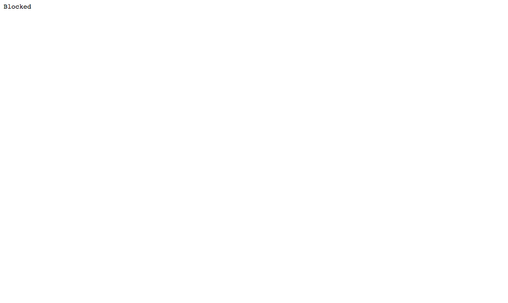

### Walk through the integration with CloudOne Application Security

In Repos, show the Dockerfile like before
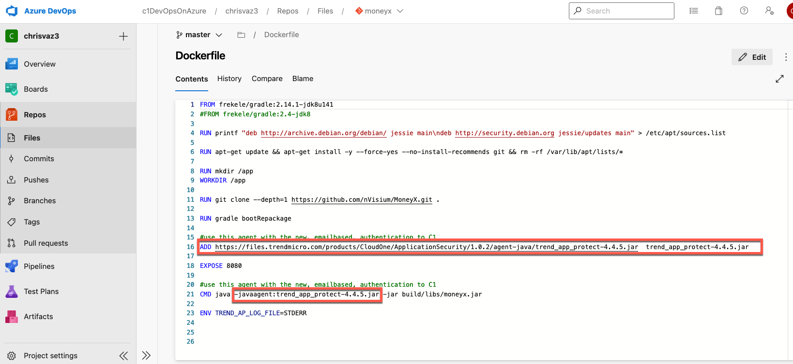

Point out:

- ADD command: this is where we import the library in our app (in this case it is a java app, so we added a java library)
- CMD command: this is where the app will get started and our library will be included.  Here we invoke the imported library

The Registration keys for CloudOne Application Security must be called per running instance, at runtime.  You can show those in the deployment.yml file under Manifests in the Azure Repos
The C1AS keys are added as Environment Variables
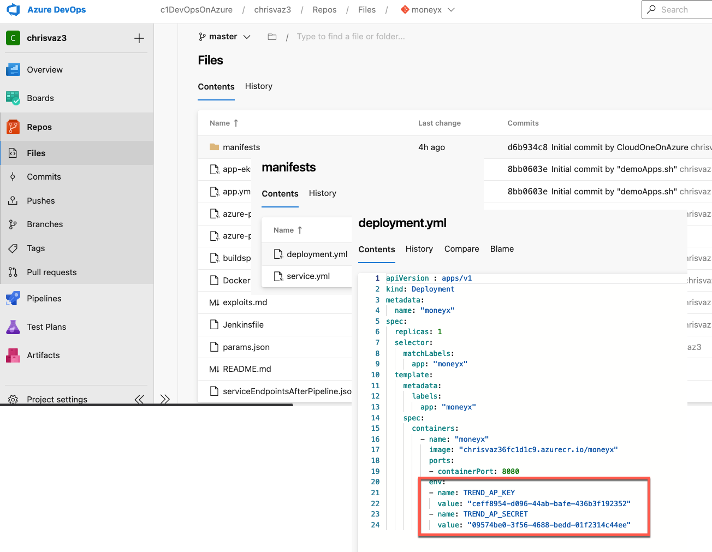

## Third pipeline walk through: Demo CloudOne Container Security (Admission Control)


- go to the CloudOne Container Security web interface and show the Admission Policy.
  Point out that this policy prevents any container with malware from starting.
  This is the reason why this pipeline-run was not able to deploy this newer version of MoneyX
  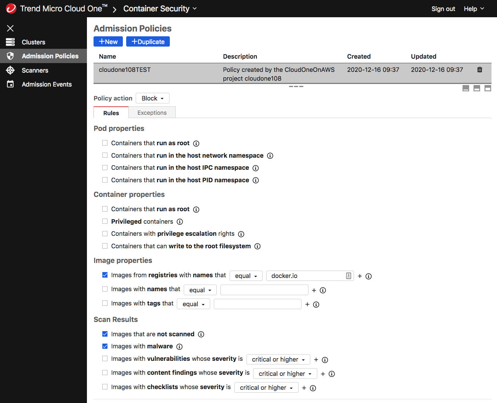
  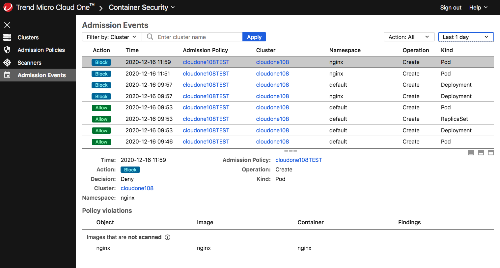
- find that scan in SmartCheck.  It should have a blue icon next to it.

<br/><br/>
<br/><br/>

## Deploy a "rogue" container

- In our CloudOne Container Security, we had also set a rule to `block unscanned images`    So, let's try to deploy a container that did not go through the pipeline.
- go to the CloudOne Container Security web interface and show the Admission Policy.Point out that we have enabled:

  - a rule to block any containers that were not build through our pipeline and were not scanned by SmartCheck
  - another rule that blocks containers that are pulled directly from docker.io (this is just an example).
    
- Demonstrate this by trying to start an nginx pod, straight from dockerhub

```shell
kubectl run  --image=nginx --namespace nginx nginx
```

- This will not be allowed and will generate the following error:

```
Error from server: admission webhook "trendmicro-admission-controller.c1cs.svc" denied the request: 
- unscannedImage violated in container(s) "nginx" (block).
```

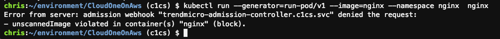

- Show the Admission Events in the WebUI:
  
- Whitelist a namespace and deploy nginx in that namespace

```
kubectl create namespace mywhitelistednamespace 
#whitelist that namespace for C1CS
kubectl label namespace mywhitelistednamespace ignoreAdmissionControl=ignore
#deploying nginx in the "mywhitelistednamespace" will now work:
kubectl run  --image=nginx --namespace mywhitelistednamespace nginx

kubectl run nginx  --image=nginx --namespace mywhitelistednamespace
kubectl get namespaces --show-labels
kubectl get pods -A | grep nginx
```

# Pull and scan additional images

To get more content for a demo, you can pull and scan additional images in SmartCheck.   

```bash
cd addOns
. ./up.scanImageAz.sh
```

**BEARE**
This will pull close to a dozen images from DockerHub and push them to your ACR registry  for scanning.
Keep in mind that this process may take more than 1 hour and should best be run quite in advance of delivering a demo.  
To pull a single image from Dockerhub, e.g. `tomcat`, you can run:

```bash
cd addOns
. ./up.scanImageAz.sh tomcat
```
